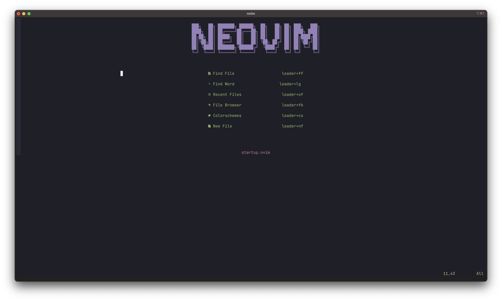
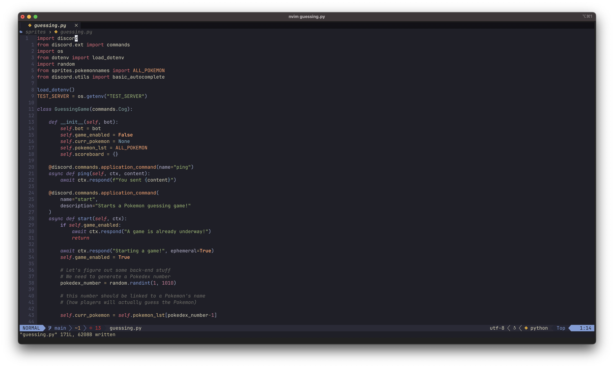

## Stephen's NVIM Dotfiles


#### Requirements:
- Latest version of neovim
- a Nerd Font
    - https://www.nerdfonts.com/font-downloads
    - I use JetBrainsMono Nerd Font with ligatures
- node.js
- `curl` or `wget`
- a true-colour terminal environment

#### Installation
Start by backing up your existing Neovim config (if you have one):
```bash
mv ~/.config/nvim ~/.config/nvim.bak
```
Next, clone the repository into your nvim config:
```bash
git clone https://github.com/clarks03/nvim-dotfiles.git ~/.config/nvim
```
And start Neovim to let Packer install the plugins!
```bash
nvim
```

